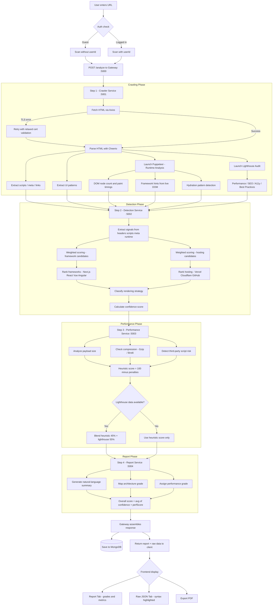
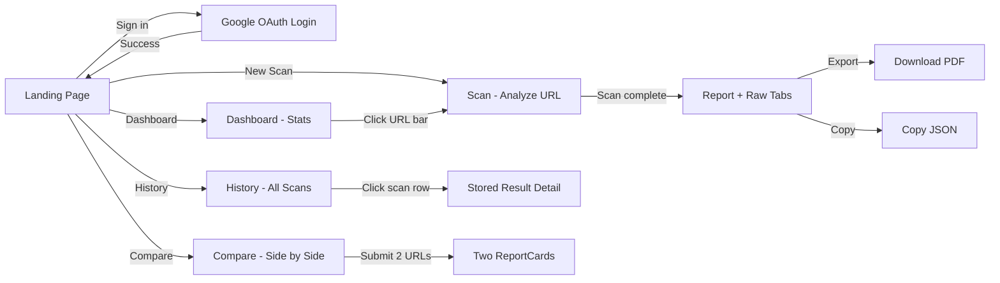

# StackLens

**Instant website technology stack detection & performance analysis.**

StackLens is a full-stack web application that analyzes any website's technology stack — detecting frameworks, hosting providers, rendering strategies, UI patterns, and performance characteristics — all from a single URL. It combines heuristic analysis, Puppeteer-based runtime inspection, and Lighthouse auditing across a distributed microservices architecture.


---

## Table of Contents

- [Features](#features)
- [Architecture](#architecture)
- [Tech Stack](#tech-stack)
- [Project Structure](#project-structure)
- [Getting Started](#getting-started)
  - [Prerequisites](#prerequisites)
  - [Environment Variables](#environment-variables)
  - [Running with Docker](#running-with-docker)
  - [Running Locally (without Docker)](#running-locally-without-docker)
- [API Reference](#api-reference)
- [Frontend Pages](#frontend-pages)
- [Microservices](#microservices)
  - [Crawler Service](#crawler-service-port-5001)
  - [Detection Service](#detection-service-port-5002)
  - [Performance Service](#performance-service-port-5003)
  - [Report Service](#report-service-port-5004)
- [Browser Extension](#browser-extension)
- [Detection Engine](#detection-engine)
- [Scoring & Grading](#scoring--grading)
- [Contributing](#contributing)
- [License](#license)

---

## Features

- **Framework Detection** — Identifies Next.js, React, Vue, Angular, Svelte, WordPress, Shopify, and more using multi-signal weighted scoring across HTTP headers, script tags, meta tags, and runtime analysis.
- **Infrastructure Detection** — Determines hosting providers (Vercel, Cloudflare, GitHub Pages) from HTTP response headers and edge indicators.
- **Rendering Strategy Analysis** — Distinguishes between CSR, SSR, ISR, and hybrid rendering through hydration pattern detection and runtime DOM inspection.
- **Performance Auditing** — Blends heuristic payload/compression/third-party analysis with real Lighthouse scores for a composite performance grade.
- **Runtime Analysis** — Launches a headless Puppeteer browser to inspect the live DOM, measure paint timings, and detect dynamic framework hints.
- **Lighthouse Integration** — Runs Google Lighthouse audits for Performance, SEO, Accessibility, and Best Practices scoring.
- **UI Pattern Detection** — Identifies common UI elements: navbars, footers, hero sections, forms, buttons, and SPA behavior.
- **Scan History** — Persists complete scan results (report + raw data) in MongoDB with per-user history and detail retrieval.
- **Side-by-Side Comparison** — Compare the tech stacks and performance of two websites simultaneously.
- **PDF Export** — Generate a downloadable PDF report with all scan details using jsPDF.
- **Chrome Extension** — Analyze any page directly from the browser toolbar without leaving the site.
- **Firebase Authentication** — Google OAuth sign-in for personalized scan history and dashboard.

---

## Architecture

```
┌─────────────────────────────────────────────────────────────┐
│                    Frontend (Next.js)                        │
│                     localhost:3000                           │
│  ┌──────┐ ┌──────────┐ ┌─────────┐ ┌────────┐ ┌─────────┐  │
│  │ Scan │ │Dashboard │ │ History │ │Compare │ │  Login  │  │
│  └──┬───┘ └──────────┘ └────┬────┘ └───┬────┘ └─────────┘  │
└─────┼────────────────────────┼──────────┼───────────────────┘
      │  POST /analyze         │ GET      │ POST /analyze ×2
      ▼                        ▼          ▼
┌─────────────────────────────────────────────────────────────┐
│                API Gateway (Express)                        │
│                  localhost:5000                              │
│         ┌──────────────┬──────────────┐                     │
│         │  /analyze    │  /history    │                     │
│         └──────┬───────┴──────────────┘                     │
│                │  Orchestrates 4 service calls               │
└────────────────┼────────────────────────────────────────────┘
                 │
    ┌────────────┼────────────┬────────────┬────────────┐
    ▼            ▼            ▼            ▼            │
┌────────┐ ┌──────────┐ ┌───────────┐ ┌─────────┐     │
│Crawler │ │Detection │ │Performance│ │ Report  │     │
│ :5001  │ │  :5002   │ │   :5003   │ │  :5004  │     │
└────────┘ └──────────┘ └───────────┘ └─────────┘     │
                                                       ▼
                                               ┌──────────────┐
                                               │  MongoDB      │
                                               │  Atlas        │
                                               └──────────────┘
```

### Data Flow

1. **User submits a URL** via the frontend or browser extension
2. **Gateway** receives the request and orchestrates the pipeline:
   - **Step 1 — Crawl:** Fetches HTML, parses scripts/meta/links, extracts UI patterns, runs Puppeteer runtime analysis, runs Lighthouse audit
   - **Step 2 — Detect:** Analyzes crawl output through the signal-based detection engine to identify framework, hosting, and rendering strategy
   - **Step 3 — Performance:** Evaluates payload size, compression, third-party risk, and blends with Lighthouse scores
   - **Step 4 — Report:** Generates human-readable summary, architecture grade, performance grade, and overall score
3. **Results** are persisted to MongoDB and returned to the client

### Analysis Pipeline Flow



### Frontend Navigation Flow



---

## Tech Stack

| Layer          | Technology                                                      |
|----------------|-----------------------------------------------------------------|
| Frontend       | Next.js 16, React 19, Tailwind CSS 4, TypeScript                |
| Authentication | Firebase Auth (Google OAuth)                                    |
| API Gateway    | Express 5, Axios, Mongoose                                     |
| Crawler        | Axios, Cheerio, Puppeteer, Lighthouse, Chrome Launcher          |
| Detection      | Custom signal-based weighted scoring engine                     |
| Performance    | Heuristic analysis + Lighthouse score blending                  |
| Report         | Template-based summary generation                               |
| Database       | MongoDB Atlas                                                   |
| PDF Export     | jsPDF                                                           |
| Containerization | Docker, Docker Compose                                        |
| Extension      | Chrome Extension (Manifest V3)                                  |

---

## Project Structure

```
stacklens/
├── docker-compose.yml          # Orchestrates all backend services
├── package.json                # Root package metadata
├── LICENSE                     # MIT License
│
├── frontend/                   # Next.js 16 web application
│   ├── app/
│   │   ├── layout.tsx          # Root layout (AuthProvider, Navbar, Footer)
│   │   ├── page.tsx            # Landing page (marketing + auth hub)
│   │   ├── scan/page.tsx       # Scan page (alias → histroy/page.tsx)
│   │   ├── dashboard/page.tsx  # User dashboard with stats & recent scans
│   │   ├── history/page.tsx    # Scan history list
│   │   ├── histroy/page.tsx    # Scan analysis & results viewer
│   │   ├── compare/page.tsx    # Side-by-side website comparison
│   │   └── login/page.tsx      # Google OAuth login
│   ├── components/
│   │   ├── Navbar.tsx          # Fixed navigation bar with auth state
│   │   ├── Footer.tsx          # Site footer with service status
│   │   ├── ScanForm.tsx        # URL input form with normalization
│   │   ├── ReportCard.tsx      # Full report display + PDF export
│   │   ├── RawPanel.tsx        # Syntax-highlighted JSON viewer
│   │   ├── ScoreBadge.tsx      # Color-coded score indicator
│   │   └── HistoryList.tsx     # Clickable scan history table
│   ├── context/
│   │   └── AuthContext.tsx     # Firebase auth state provider
│   ├── lib/
│   │   ├── api.ts              # API client (analyze, history, historyById)
│   │   └── firebase.ts         # Firebase app initialization
│   └── types/
│       └── index.ts            # Shared TypeScript types
│
├── gateway/                    # API Gateway (Express)
│   ├── src/
│   │   ├── server.ts           # Express app setup & route mounting
│   │   ├── config/
│   │   │   └── db.ts           # MongoDB connection
│   │   ├── controllers/
│   │   │   └── analyze.controller.ts  # Orchestration logic
│   │   ├── models/
│   │   │   └── scan.model.ts   # Mongoose scan schema
│   │   └── routes/
│   │       ├── analyze.routes.ts  # POST /analyze
│   │       └── history.routes.ts  # GET /history, GET /history/:id
│   └── Dockerfile
│
├── services/
│   ├── crawler-service/        # Website crawling & runtime analysis
│   │   ├── src/
│   │   │   ├── server.ts
│   │   │   ├── controllers/crawl.controller.ts
│   │   │   ├── services/crawler.service.ts
│   │   │   ├── parsers/
│   │   │   │   ├── html.parser.ts       # Script/meta/link extraction
│   │   │   │   └── uiPattern.parser.ts  # UI element detection
│   │   │   ├── routes/crawl.routes.ts
│   │   │   └── utils/urlValidator.ts
│   │   └── Dockerfile
│   │
│   ├── detection-service/      # Technology detection engine
│   │   ├── src/
│   │   │   ├── server.ts
│   │   │   ├── controllers/detect.controller.ts
│   │   │   ├── engine/
│   │   │   │   ├── signalExtractor.ts   # Signal normalization
│   │   │   │   ├── detector.ts          # Weighted scoring logic
│   │   │   │   ├── framework.detector.ts   # (legacy)
│   │   │   │   ├── infra.detector.ts       # (legacy)
│   │   │   │   ├── rendering.detector.ts   # (legacy)
│   │   │   │   └── scoring.engine.ts       # (legacy)
│   │   │   ├── routes/
│   │   │   └── types/detection.types.ts
│   │   └── Dockerfile
│   │
│   ├── performance-service/    # Performance analysis engine
│   │   ├── src/
│   │   │   ├── server.ts
│   │   │   ├── controllers/performance.controller.ts
│   │   │   ├── engine/
│   │   │   │   ├── payload.analyzer.ts      # Payload size scoring
│   │   │   │   ├── compression.checker.ts   # Gzip/Brotli detection
│   │   │   │   ├── thirdparty.detector.ts   # 3rd-party script risk
│   │   │   │   └── risk.scorer.ts           # Composite scoring
│   │   │   ├── routes/
│   │   │   └── types/performance.types.ts
│   │   └── Dockerfile
│   │
│   └── report-service/         # Report generation
│       ├── src/
│       │   ├── server.ts
│       │   ├── controllers/report.controller.ts
│       │   ├── formatter/
│       │   │   ├── summary.generator.ts       # Natural language summary
│       │   │   ├── architecture.mapper.ts     # Architecture grading
│       │   │   └── confidence.calculator.ts   # Overall score calc
│       │   ├── routes/
│       │   └── types/report.types.ts
│       └── Dockerfile
│
├── shared/                     # Shared types & constants (placeholders)
│   ├── constants/
│   │   ├── framework.signatures.ts
│   │   ├── infra.signatures.ts
│   │   └── scoring.rules.ts
│   └── types/
│       ├── crawl.types.ts
│       ├── detection.types.ts
│       ├── performance.types.ts
│       └── report.types.ts
│
└── stacklens-extension/        # Chrome browser extension
    ├── manifest.json
    ├── popup.html
    ├── popup.js
    └── popup.css
```

---

## Getting Started

### Prerequisites

- **Node.js** >= 20
- **npm** >= 9
- **Docker** & **Docker Compose** (for containerized deployment)
- **MongoDB Atlas** account (or a local MongoDB instance)
- **Firebase** project (for Google OAuth authentication)
- **Google Chrome** (required by Puppeteer/Lighthouse in the crawler service)

### Environment Variables

Create a `.env` file in the project root with the following variables:

```env
# MongoDB
MONGO_URI=mongodb+srv://<username>:<password>@<cluster>.mongodb.net/stacklens

# Service URLs
CRAWLER_URL=http://localhost:5001
DETECTION_URL=http://localhost:5002
PERFORMANCE_URL=http://localhost:5003
REPORT_URL=http://localhost:5004
```

Create a `.env.local` file in the `frontend/` directory:

```env
NEXT_PUBLIC_FIREBASE_API_KEY=your_firebase_api_key
NEXT_PUBLIC_FIREBASE_AUTH_DOMAIN=your_project.firebaseapp.com
NEXT_PUBLIC_FIREBASE_PROJECT_ID=your_project_id
NEXT_PUBLIC_FIREBASE_STORAGE_BUCKET=your_project.firebasestorage.app
NEXT_PUBLIC_FIREBASE_MESSAGING_SENDER_ID=your_sender_id
NEXT_PUBLIC_FIREBASE_APP_ID=your_app_id
NEXT_PUBLIC_API_URL=http://localhost:5000
```

### Running with Docker

The simplest way to start all backend services:

```bash
# Build and start all services (gateway + 4 microservices)
docker compose up -d --build

# Start the frontend separately
cd frontend
npm install
npm run dev
```

This starts:
| Service     | Port |
|-------------|------|
| Gateway     | 5000 |
| Crawler     | 5001 |
| Detection   | 5002 |
| Performance | 5003 |
| Report      | 5004 |
| Frontend    | 3000 |

### Running Locally (without Docker)

Start each service in a separate terminal:

```bash
# Terminal 1 — Gateway
cd gateway
npm install
npm run dev

# Terminal 2 — Crawler Service
cd services/crawler-service
npm install
npm run dev

# Terminal 3 — Detection Service
cd services/detection-service
npm install
npm run dev

# Terminal 4 — Performance Service
cd services/performance-service
npm install
npm run dev

# Terminal 5 — Report Service
cd services/report-service
npm install
npm run dev

# Terminal 6 — Frontend
cd frontend
npm install
npm run dev
```

Open [http://localhost:3000](http://localhost:3000) in your browser.

---

## API Reference

### Gateway Endpoints

#### `POST /analyze`

Triggers a full website analysis pipeline.

**Request Body:**
```json
{
  "url": "https://example.com",
  "userId": "firebase-uid-123"  // optional
}
```

**Response:**
```json
{
  "report": {
    "summary": "The website appears to use Next.js, hosted on Vercel Edge, following Hydrated SSR/ISR.",
    "architectureGrade": "Strongly Identified Architecture",
    "performanceGrade": "High Performance",
    "overallScore": 87,
    "metrics": {
      "performance": 92,
      "seo": 100,
      "accessibility": 85,
      "bestPractices": 96,
      "renderTimingMs": {
        "domContentLoaded": 412,
        "load": 1580,
        "firstContentfulPaint": 320
      }
    },
    "stackInsights": {
      "frameworkCandidates": [
        { "name": "Next.js", "score": 68 },
        { "name": "React", "score": 38 }
      ],
      "hostingCandidates": [
        { "name": "Vercel Edge", "score": 70 }
      ],
      "detectedTechnologies": ["Tailwind", "Vercel Edge"]
    }
  },
  "raw": {
    "detection": { ... },
    "performance": { ... },
    "uiPatterns": { ... },
    "runtimeAnalysis": { ... },
    "lighthouse": { ... }
  }
}
```

#### `GET /history?userId=<uid>`

Returns all scans for a user, sorted by most recent.

#### `GET /history/:id?userId=<uid>`

Returns a single stored scan by its MongoDB document ID.

#### `GET /health`

Returns service health status.

### Microservice Endpoints

| Service     | Endpoint               | Method | Description                    |
|-------------|------------------------|--------|--------------------------------|
| Crawler     | `/crawl`               | POST   | Crawl URL, parse HTML, run runtime analysis & Lighthouse |
| Detection   | `/detect`              | POST   | Detect framework, hosting, rendering |
| Performance | `/analyze-performance` | POST   | Analyze payload, compression, third-party risk |
| Report      | `/generate-report`     | POST   | Generate grades, summary, and overall score |
| All         | `/health`              | GET    | Health check                   |

---

## Frontend Pages

| Route        | Description                                                   |
|--------------|---------------------------------------------------------------|
| `/`          | Landing page — marketing for guests, navigation hub for users |
| `/login`     | Google OAuth sign-in via Firebase                             |
| `/scan`      | URL input + scan results viewer (Report & Raw JSON tabs)      |
| `/dashboard` | Personal dashboard with stats, recent scans, and framework breakdown |
| `/history`   | List of all past scans with click-to-view detail              |
| `/compare`   | Side-by-side tech stack & performance comparison of two sites |

### Key UI Components

- **ReportCard** — Displays architecture grade, performance grade, overall score, Lighthouse metrics (4-column grid), UI patterns checklist, detected technologies, and a PDF export button.
- **RawPanel** — Syntax-highlighted JSON viewer with line numbers, copy-to-clipboard, and download-as-JSON.
- **HistoryList** — Responsive table with score ring charts, render mode badges, relative timestamps, and click-to-navigate.
- **ScanForm** — URL input with automatic `https://` normalization.
- **ScoreBadge** — Color-coded score chip (green >80, yellow >60, red ≤60).

---

## Microservices

### Crawler Service (Port 5001)

Fetches the target URL's HTML and performs deep analysis:

- **HTML Parsing** — Extracts `<script src>`, `<meta>`, and `<link href>` tags using Cheerio.
- **UI Pattern Extraction** — Detects navbars, footers, hero sections, form count, button count, and SPA indicators.
- **TLS Fallback** — Retries with relaxed certificate validation on TLS errors.
- **Runtime Analysis** — Launches headless Puppeteer to:
  - Count DOM nodes (static vs runtime)
  - Measure First Contentful Paint, DOMContentLoaded, and Load timings
  - Detect frameworks from live DOM (`_next`, `react`, `vue`, `angular`, `svelte`, etc.)
  - Identify hydration patterns (`__NEXT_DATA__`, `data-reactroot`, hydrate calls)
- **Lighthouse Audit** — Runs Google Lighthouse for Performance, SEO, Accessibility, and Best Practices scores (0–100).
- **Graceful Degradation** — Runtime analysis and Lighthouse failures are non-blocking; zero-value defaults are returned.

### Detection Service (Port 5002)

Multi-signal technology detection engine:

- **Signal Extraction** — Combines HTTP headers, script sources, meta tags, link hrefs, and runtime hints into normalized boolean signals.
- **Weighted Scoring** — Assigns weighted scores to framework and hosting candidates:
  - WordPress/Shopify: +45, Next.js: +42 (with `__NEXT_DATA__`), Svelte: +36, Vue/Angular: +35, React: +20
  - Vercel Edge: +42/+28, Cloudflare CDN: +35, GitHub: +25
- **Rendering Classification** — Hydrated SSR/ISR (hydration detected), Hybrid SSR (Next.js data present), or Likely CSR.
- **Confidence Calculation** — `max(50, min(99, round(50 + detectionPower / 2.2)))`.

### Performance Service (Port 5003)

Payload and performance heuristic analysis:

- **Payload Analysis** — Estimates total payload (`htmlSize + scripts × 50KB`): Light (<300KB), Moderate (<800KB), Heavy (≥800KB).
- **Compression Check** — Detects Gzip/Brotli from `content-encoding` header.
- **Third-Party Risk** — Scans for tracking scripts (Google Tag Manager, Analytics, DoubleClick, Facebook).
- **Score Blending** — If Lighthouse data is available: `round(heuristic × 0.45 + lighthouse × 0.55)`.

### Report Service (Port 5004)

Human-readable report generation:

- **Summary** — Natural language description: *"The website appears to use Next.js, hosted on Vercel Edge, following Hydrated SSR/ISR. A hero section is present."*
- **Architecture Grade** — >80 confidence: "Strongly Identified", >60: "Moderately Identified", ≤60: "Low Confidence".
- **Performance Grade** — Lighthouse ≥90 or heuristic >85: "High Performance", ≥70 or >65: "Moderate", else: "Needs Optimization".
- **Overall Score** — `round((detectionConfidence + performanceScore) / 2)`.

---

## Browser Extension

A lightweight Chrome extension (Manifest V3) that lets you analyze any website directly from the toolbar:

1. Navigate to any webpage
2. Click the StackLens extension icon
3. Click **"Analyze This Page"**
4. View the detected framework, hosting, and overall score in the popup

### Installation

1. Open `chrome://extensions/` in Chrome
2. Enable **Developer mode**
3. Click **Load unpacked** and select the `stacklens-extension/` directory

> **Note:** The extension requires the gateway to be running at `http://localhost:5000`.

---

## Detection Engine

The detection engine uses a **multi-signal weighted scoring system** rather than simple pattern matching. This produces ranked candidates with confidence levels instead of binary yes/no answers.

### Signals Analyzed

| Signal Source          | Data Points                                                    |
|------------------------|----------------------------------------------------------------|
| HTTP Headers           | `x-powered-by`, `server`, `x-vercel-id`, `cf-ray`, `content-encoding` |
| Script Tags            | Framework-specific bundles (`_next/`, `react`, `vue`, `angular`) |
| Meta Tags              | Generator meta, Open Graph markers                             |
| Link Tags              | Stylesheet CDN patterns, preload hints                         |
| Runtime DOM            | Live DOM inspection via Puppeteer for framework markers        |
| Hydration Patterns     | `__NEXT_DATA__`, `data-reactroot`, hydrate function calls      |
| UI Structure           | Navbar, footer, hero, forms, SPA root elements                 |

### Framework Detection Weights

| Framework  | Base Signal Weight | Runtime Bonus | Additional              |
|------------|-------------------|---------------|--------------------------|
| WordPress  | +45               | —             | `wp-content` in sources  |
| Shopify    | +45               | —             | `shopify` in sources     |
| Next.js    | +42               | +18           | +8 if Tailwind detected  |
| Svelte     | +36               | —             | —                        |
| Vue        | +35               | +12           | +5 if Tailwind           |
| Angular    | +35               | +12           | `ng-version` attribute   |
| React      | +20               | +12           | +12 if Redux, +6 if Tailwind |

---

## Scoring & Grading

### Confidence Score

```
detectionPower = topFrameworkScore + topHostingScore
confidence = max(50, min(99, round(50 + detectionPower / 2.2)))
```

### Performance Score

```
heuristicScore = max(100 - payloadPenalty - compressionPenalty - thirdPartyPenalty, 0)

finalScore = lighthouseAvailable
  ? round(heuristicScore × 0.45 + lighthousePerformance × 0.55)
  : heuristicScore
```

### Overall Score

```
overallScore = round((confidence + performanceScore) / 2)
```

### Grade Thresholds

| Metric             | High                 | Moderate             | Low                      |
|--------------------|----------------------|----------------------|--------------------------|
| Architecture Grade | Confidence > 80      | Confidence > 60      | Confidence ≤ 60          |
| Performance Grade  | LH ≥ 90 or Score > 85 | LH ≥ 70 or Score > 65 | Below thresholds        |
| Score Badge Color  | Green (> 80)         | Yellow (> 60)        | Red (≤ 60)               |

---

## Contributing

1. Fork the repository
2. Create a feature branch (`git checkout -b feature/amazing-feature`)
3. Commit your changes (`git commit -m 'feat: add amazing feature'`)
4. Push to the branch (`git push origin feature/amazing-feature`)
5. Open a Pull Request

---

## License

This project is licensed under the MIT License — see the [LICENSE](LICENSE) file for details.

---

**Built by [Shanidhya Kumar](https://github.com/Shanidhya01)**
